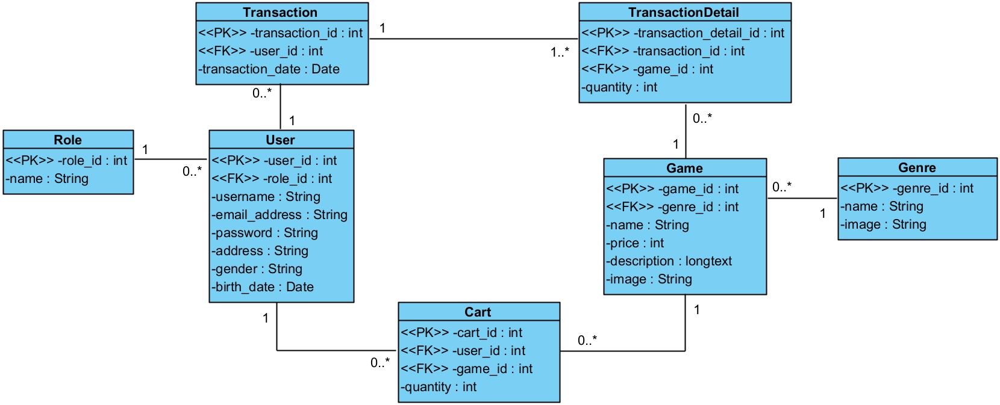
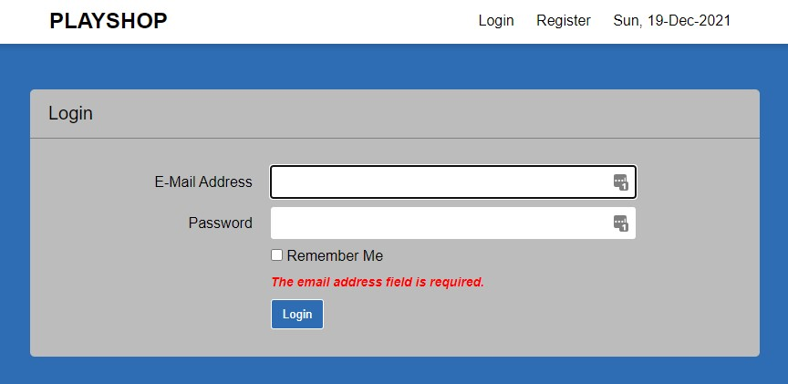
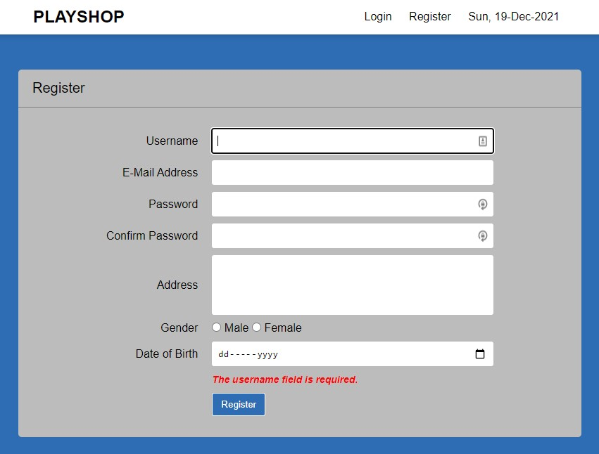
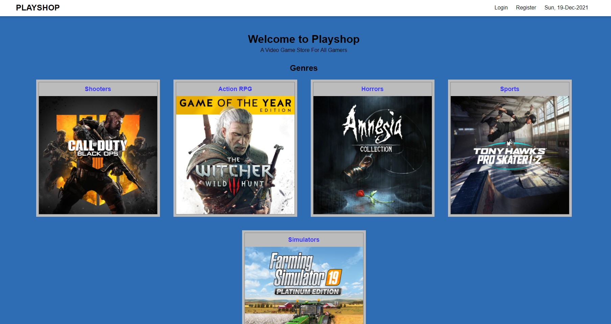
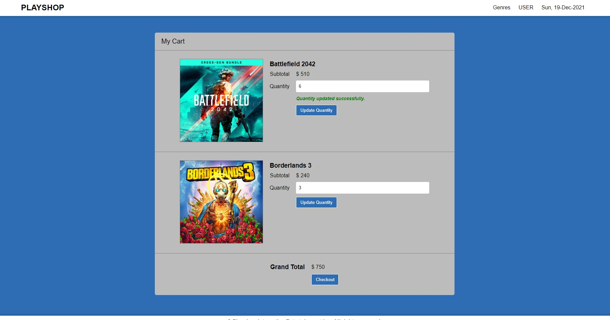
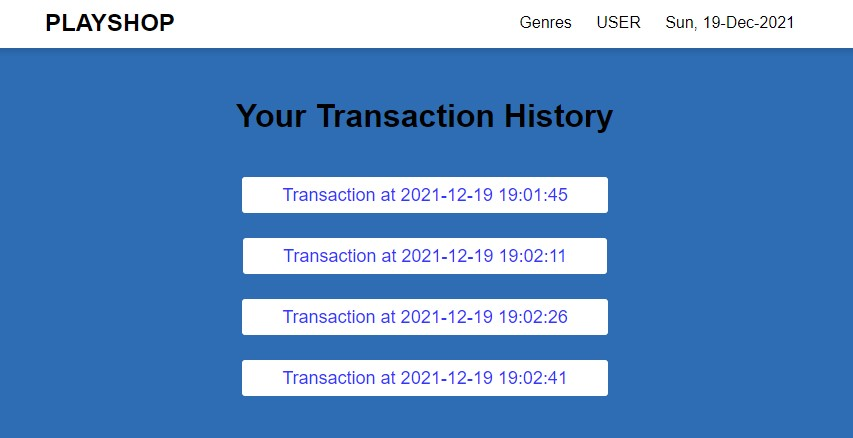
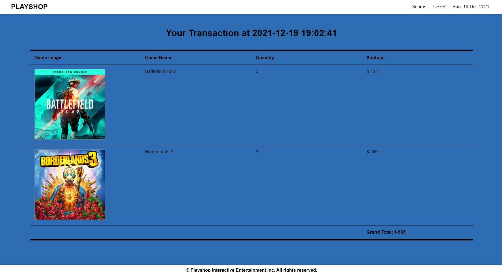
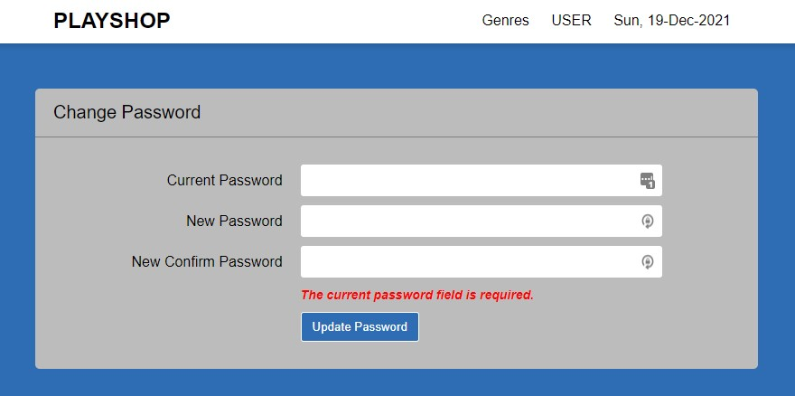
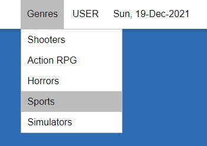
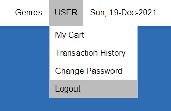

# Keypedia
A web application to buy, sell, and manage keyboards in a keyboard store. There are three types of users that can access this website: guest, customer, and manager. Guest are users who are not logged in, while customer and manager are users who have logged in. Customer can do things like buy keyboards, add them to their cart, while managers can update keyboards, delete keyboards, and other management activities. More in depth difference between customer and manager will be shown in the Report / Documentation. This web application was built using Laravel 8 with MVC (Model View Controller) architecture, MySQL as database, and minimalizes human error with input validations.

# Startup Guide
1. Install XAMPP, then start Apache and MySQL module (make sure these two modules are active, otherwise the application can't connect to the database and won't start).
2. Go to http://localhost/phpmyadmin/.
3. Create a database named 'keypediadb'.
4. Open the project's directory in a terminal and run the command: 
    - *php artisan migrate:refresh* (to migrate tables to the database)
    - *php artisan db:seed* (to fill those table with values)
    - *php artisan serve*
5. Open the link given after the last command to open the web application.

# Class Diagram for Keypedia's Database

Below is the preview of the application:

# (1/18) Login Page

Login page allows guests to log in to the website by typing email and password and checking if that user exists in the database. It must be noted that only guests are allowed to access this page. If you are a logged in user such as manager or customer, you have to first log out of the website before you can access this page. The login method will validate your input by making sure that both email and password fields are filled, and that for the email field you must input a valid email address (string with a @).

# (2/18) Register Page

Register page allows guest to register themselves as a customer in Keypedia. Once they fill the registration form and pressing the register button, they will now be able to log into Keypedia. This form will make sure that you entered all of the fields, and other validation such as the username must have a minimum of 5 characters, confirm password must have the same value as password, etc.

# (3/18) Home Page

Home page is the main page of Keypedia. This page is accessible to all. Guest, customer, and manager. In here, you can see all of the categories of keyboards that are available to be sold to customers in Keypedia. Click the blue text on top of the image to be redirected to the View Keyboard page.

# (4/18) View Keyboard Page (as Guest or Customer)
.jpg)
View Keyboards page will show you all keyboards that are categorized as the one you clicked on Home page. In this case, we are seeing keyboards which are categorized as Corsair. Here, you can make use of the search function by typing a keyword of the name or the price then click the search button. Other than that, this page also implements Laravel’s pagination by dividing each page up to maximum of 8 keyboards per page. This page can be accessed by all users, but guest and customer can only click the name of the keyboard to go to that keyboard’s Keyboard Detail page.

# (5/18) View Keyboard Page (as Manager)
.jpg)
This is how the View Keyboard page looks like if you were a manager. Managers can delete a keyboard by clicking on the delete button on the specific keyboard that they want to delete, doing this will bring up a prompt confirming if you really want to do this. Managers can also update a specific keyboard by clicking on the update keyboard button which will redirect them to the Update Keyboard page.

# (6/18) Update Keyboard Page
.jpg)
Update Keyboard page is only accessible to manager. This page will show all of the data from the chosen keyboard and the manager can edit them by picking a new category, new name, price, description, or upload a new image for this keyboard. The manager input will be validated first before processed, most of them are usual validation such as fields cannot be empty, except the image field (which can be ignored), but one of the validations is that if nothing was changed and the manager pressed the update keyboard button, it will show an error that nothing was changed.

# (7/18) Keyboard Detail Page (as Guest or Customer)
.jpg)
Keyboard Detail page is accessible by all users, but guest and customer can see the quantity field and add to cart button. This page shows the selected keyboard details such as image, name, price, and description. Other than that, customer can add a quantity of this keyboard to their shopping cart. If a guest tries to add this keyboard to a cart, they will be redirected to the login page instead where they will be forced to log in before they can put this item on their cart.

# (8/18) Keyboard Detail Page (as Manager)
.jpg)
The Keyboard Detail page for the manager is less dense. Because manager can’t add keyboards to the cart. This page for manager is only to see the keyboard’s detailed information.

# (9/18) Add Keyboard Page

Add Keyboard page is only accessible to manager. In this page, manager can add new keyboard to the website’s database. This page can be accessed through the manager’s dropdown menu on the navigation bar on the top right. The website will validate the manager’s input if they for example didn’t input any keyboard name, etc.

# (10/18) Manage Category Page

Manage Category page is only accessible to manager. Here, the manager can see all of the categories of keyboard that are available in Keypedia. On top of that, manager have the options to either delete or update a category, pressing the delete button will bring up a prompt confirming if you really want to do delete this category. If they delete a category, all keyboards that belong to that category will be deleted as well. If the manager clicks the update category button, they will be redirected to the Update Category page of the chosen category.

# (11/18) Update Category Page

Update Category page is only accessible to manager. In this page, manager can change the chosen category’s name or upload a new image to that category. Changing the category image is not required to update, but in order to update the manager must have at least change one: the name, or the image of the category. If manager uploads a new image, that image will be saved in the public/images directory.

# (12/18) My Cart Page

My Cart page is only accessible to customer. Here, customer can see every keyboard that they have added to their cart. Their name, and quantity of each keyboard, along with the subtotal for each keyboard and the grand total cost of all keyboards. Other than that, customer can also update the quantity of each keyboard that they have added to the cart, if they input 0 to the quantity, then that keyboard will be removed from their cart, a validation of successful updates and errors will appear beneath the chosen keyboard’s quantity text field. At the bottom they can click the checkout button if everything is according to what they want. That will remove all items from their cart and make a transaction record in their user id and the timestamp of when they press the checkout button.

# (13/18) Transaction History Page

Transaction History page is only accessible to customer. In this page, the website will show the customer all of their transaction records. The date down to the seconds. Customer can press the text on a specific transaction record to be redirected to that record’s Transaction History Detail page.

# (14/18) Transaction History Detail Page

Transaction History Detail page is only accessible to customer. This page will show a more detailed transaction record. Here, customer can see all of the information about the keyboards that they bought, how much quantity for each, their subtotals, and the grand total of the transaction at the bottom.

# (15/18) Change Password Page

Change Password page is only accessible to customer and manager. In this page, they can change their current password to a new one. If they want to change it, they have to input their current password, new password, and confirm their new password by typing it again on the third text field. After that, they can press the update password button.

# (16/18) Navbar Category Menu

This is what the navigation menu for the category’s dropdown list look like. This list contains all of the categories available at Keypedia. This menu is available to be seen and used by customer and manager only.

# (17/18) Navbar Customer Menu

The user navigation dropdown menu is only available if you are a customer, they contain customer exclusive features. That said, the logout option is available to both user and manager, and clicking that will log you out of the website and make you a guest.

# (18/18) Navbar Manager Menu

The manager navigation dropdown menu is only available if you are a manager, they contain manager exclusive features.
